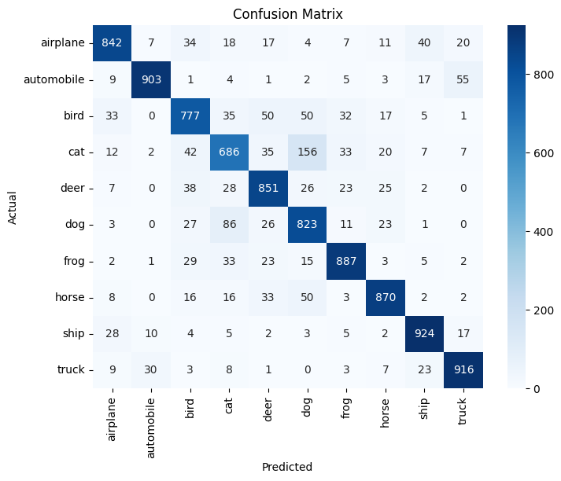
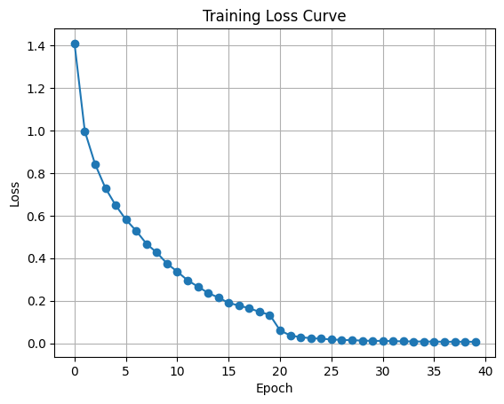

# CIFAR-10 CNN Classifier (PyTorch)

## 📌 Overview

This project implements a Convolutional Neural Network (CNN) for CIFAR-10 image classification using PyTorch.

The model was trained with:
- Weight decay (L2 regularization)
- Learning rate scheduling (StepLR)

The goal was to systematically improve baseline performance and analyze training behavior.

---
## 📁 Dataset

CIFAR-10 consists of 60,000 32x32 color images in 10 classes.

- Original training set: 50,000 images
- Test set: 10,000 images
- Training set used (after 80/20 split): 40,000 images
- Validation set: 10,000 images

## 🧠 Model Architecture

- 3 Convolutional Blocks
- Batch Normalization
- ReLU Activation
- MaxPooling
- Dropout
- Fully Connected Classifier

## ⚙️ Training Setup

- Optimizer: Adam  
- Initial Learning Rate: 0.001  
- Weight Decay: 1e-4  
- Scheduler: StepLR (step_size=20, gamma=0.1)  
- Epochs: 40  
- Batch Size: 32 / 64 (experimented)
- Note: Results may vary slightly due to random initialization and data shuffling.
---

## 📊 Results

Final Model Test Accuracy: **84.79%**

| Configuration | Test Accuracy |
|---------------|--------------|
| Baseline CNN (with augmentation) | 83.31% |
| + Weight Decay + Scheduler | 84.79% |

---

## 📈 Observations

- Validation accuracy improved significantly after learning rate decay.
- Weight decay reduced overfitting and improved generalization.
- Most misclassifications occurred between visually similar classes (e.g., cat vs dog).

---

## 🔍 Confusion Matrix



## 📈 Training Curve



---

## 🚀 How to Run

### 1️⃣ Install dependencies
```bash
pip install -r requirements.txt
```

### 2️⃣ Run the training pipeline

```bash
python train.py
```

### 3️⃣ Project Structure
The training pipeline is implemented in train.py, with the following modules:


- `model.py` – CNN architecture
- `dataset.py` – Data loading and transformations
- `utils.py` – Helper functions (e.g., accuracy calculation)


### 4️⃣ Experiments & Visualization

The notebook`CIFAR10.ipynb`zzcontains experimentation, visualization, and analysis such as the training curves and confusion matrix.